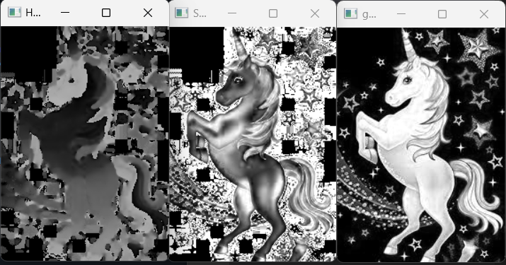

## Color Conversion
## Aim:
To perform the color conversion between RGB, BGR, HSV, and YCbCr color models.

## Software Required:
Anaconda - Python 3.7

## Algorithm:
## Step1:
Import cv2 and save and image as filename.jpg

## Step2:
Use imread(filename, flags) to read the file

## Step3:
Use cv2.cvtColor(src, code, dst, dstCn) to convert an image from one color space to another.

## Step4:
Split and merge the image using cv2.split and cv2.merge commands.

## Step5:
End the program and close the output image windows.

## Program:
## Developed By:B.Pavizhi
## Register Number:212221230077
## i) Original image
```
import cv2
uni = cv2.imread('uni.jpg')
cv2.imshow('Original image',uni)
cv2.waitKey(0)
cv2. destroyAllWindows()
```
## ii) Convert BGR to HSV 
```
import cv2
uni = cv2.imread('uni.jpg')
hsv_image = cv2.cvtColor(uni, cv2.COLOR_BGR2HSV)
cv2.imshow('BGR2HSV' ,hsv_image )
cv2.waitKey(0)
cv2. destroyAllWindows()
```
## iii) Convert BGR to GRAY
```
import cv2
uni = cv2.imread('uni.jpg')
gray_image = cv2.cvtColor(uni, cv2.COLOR_BGR2GRAY)
cv2.imshow( 'BGR2GRAY', gray_image)
cv2.waitKey(0)
cv2. destroyAllWindows()
```
## iV) Convert RGB to HSV
```
import cv2
uni = cv2.imread('uni.jpg')
hsv_image = cv2.cvtColor(uni, cv2.COLOR_RGB2HSV)
cv2.imshow('RGB2HSV', hsv_image)
cv2.waitKey(0)
cv2. destroyAllWindows()
```
## V) Convert RGB to GRAY
```
import cv2
uni = cv2.imread('uni.jpg')
gray_image1 = cv2.cvtColor (uni, cv2.COLOR_RGB2GRAY)
cv2.imshow('RGB2GRAY', gray_image1)
cv2.waitKey(0)
cv2. destroyAllWindows()
```
## Vi) Convert HSV to RGB
```
import cv2
uni = cv2.imread('uni.jpg')
RGB_image = cv2.cvtColor(uni,cv2.COLOR_HSV2RGB)
cv2.imshow('HSV to RGB',RGB_image )
cv2.waitKey(0)
cv2.destroyAllWindows()
```
## vii) Convert HSV to BGR
```
import cv2
uni = cv2.imread('uni.jpg')
BGR_image = cv2.cvtColor(uni,cv2.COLOR_HSV2BGR)
cv2.imshow('HSV to BGR',BGR_image)
cv2.waitKey(0)
cv2.destroyAllWindows()
```
## viii) Convert RGB to YCrCb
```
import cv2
uni = cv2.imread('uni.jpg')
YCrCb_image = cv2.cvtColor(uni, cv2.COLOR_RGB2YCrCb)
cv2.imshow('RGB2YCrCb',YCrCb_image)
cv2.waitKey(0)
cv2.destroyAllWindows()
```
## ix) Convert BGR to YCrCb
```
import cv2
uni = cv2.imread('uni.jpg')
YCrCb_image = cv2.cvtColor(uni, cv2.COLOR_BGR2YCrCb)
cv2.imshow('BGR2YCrCb',YCrCb_image)
cv2.waitKey(0)
cv2.destroyAllWindows()
```
## x) Split RGB Image
```
import cv2
uni = cv2.imread('uni.jpg')
blue=uni[:,:,0]
green=uni[:,:,1]
red=uni[:,:,2]
cv2.imshow('B-Channel',blue)
cv2.imshow('G-Channel',green)
cv2.imshow('R-Channel',red)
```
## xi) Merge RGB Image
```
merged_BGR=cv2.merge((blue,green,red))
cv2.imshow('Merged BGR Image',merged_BGR)
cv2.waitKey(0)
cv2.destoryAllWindows()
```
## xii) Split HSV Image
```
import cv2
uni = cv2.imread('uni.jpg')
hsv=cv2.cvtColor(uni,cv2.COLOR_BGR2HSV)
h,s,v=cv2.split(hsv)
cv2.imshow("Hue-image",h)
cv2.imshow("Saturation-image",s)
cv2.imshow("gray-image",v)
```
## xiii) Merge HSV Image
```
Merged_HSV=cv2.merge((h,s,v))
cv2.imshow('Merged HSV Image',Merged_HSV)
cv2.waitKey(0)
cv2.destoryAllWindows()
```

## Output:
## i) Original image

## ii) Convert BGR to HSV

## iii) Convert BGR to GRAY

## iV) Convert RGB to HSV

## V) Convert RGB to GRAY

## Vi) Convert HSV to RGB

## vii) Convert HSV to BGR

## viii) Convert RGB to YCrCb

## ix) Convert BGR to YCrCb

## x) Split RGB Image

## xi) Merge RGB Image

## xii) Split HSV Image

## xiii) Merge HSV Image


## Result:
Thus the color conversion was performed between RGB, HSV and YCbCr color models.
